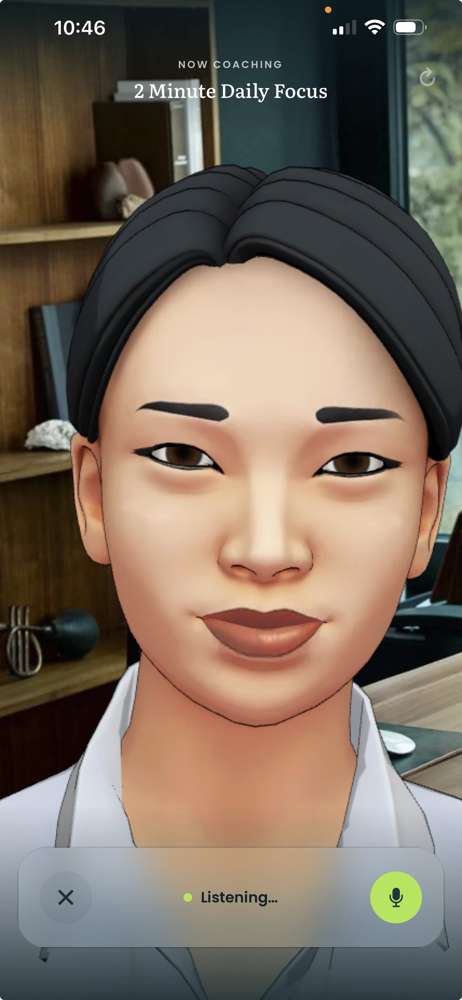
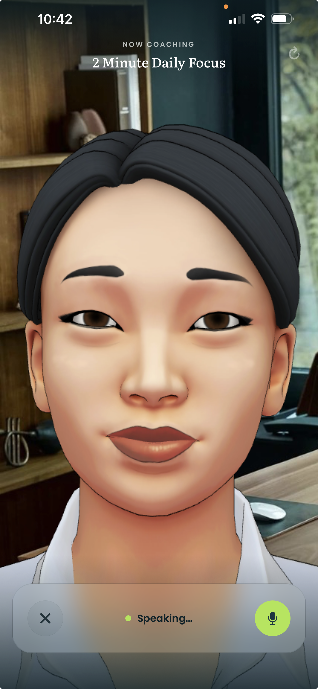

# David Nicol

CTO & Technical Lead at [Bravyn](https://bravyn.ai) - building AI-powered leadership coaching. Hands-on tech leader specialising in conversational AI, multi-agent orchestration, RAG architectures, and context engineering.

I build things end-to-end: from infrastructure (AWS/Terraform/Kubernetes) through backend systems to AI pipelines and user experience. Career spanning fintech, video delivery (local and broadcast IP), e-commerce, and now AI/ML.

### What I'm working on

**[Bravyn](https://bravyn.ai)** - AI leadership coaching platform with full-screen avatar-based coaching on iOS and Android. React Native, voice synthesis, Python/FastAPI, multi-agent orchestration, streaming inference, LLM observability, Ruby on Rails, AWS

  
  

Real-time avatar coaching: on-device speech recognition and voice synthesis drive a full-screen avatar through the listening / speaking loop.

**[RefTracker](https://github.com/dznicol/reftracker)** - computer vision + Gemini pipeline that tracks rugby referees and explains their decisions. YOLOv8, BoTSORT/CLIP-ReID, OpenCV, Supervision

  

One colour-first tracking pass, rendered at three zoom levels — the referee is ~40px tall in the original 1920×1080 footage.

### Research

- **Effective Conversational Closure in Supportive Dialogue** (with Ruyi Wang et al.) - pre-publication, targeting EMNLP 2026 Industry Track. A four-dimensional latent-space classifier that steers a coaching model at inference time, addressing maintenance bias and termination inertia. Production system outperforms baseline models across 85% of real sessions.

### Areas of focus

**AI/ML** - LLM application development, multi-agent orchestration, RAG, context engineering, evaluation and safety pipelines, conversational AI, computer vision

**Infrastructure** - AWS, Terraform, Docker, Kubernetes, IP networking, video delivery

**Product** - 0-to-1 product architecture, UX-driven development, full-stack delivery

### Connect

